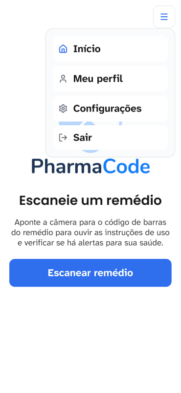
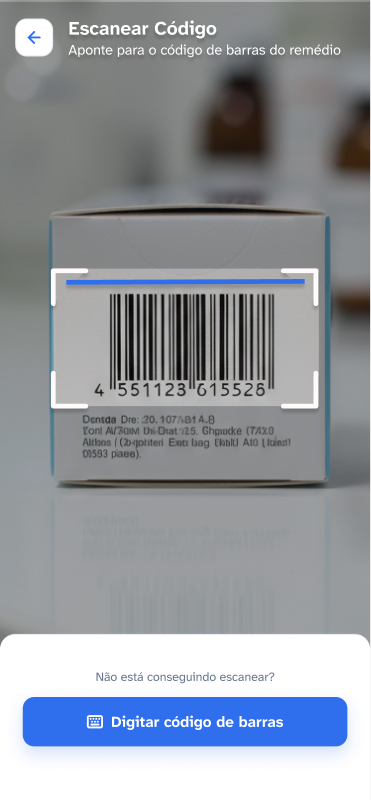
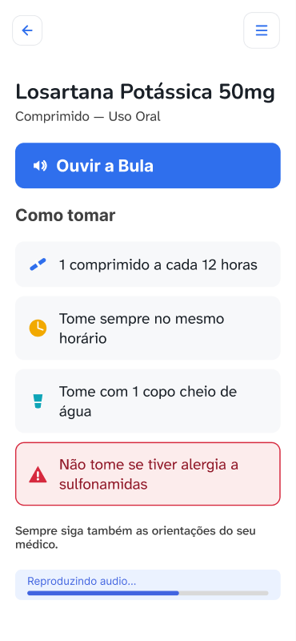
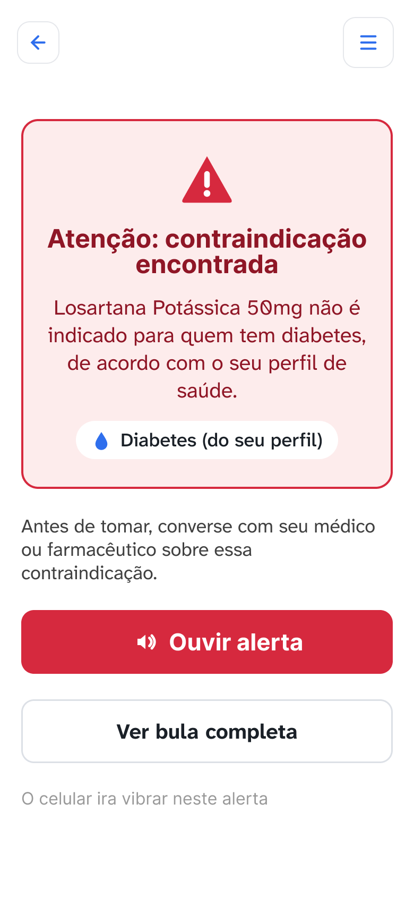
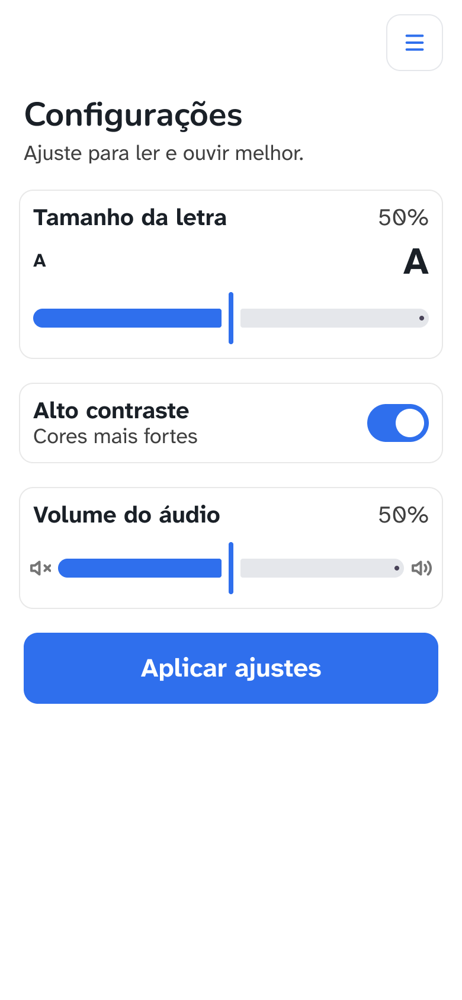

# PharmaCode 💊

> Aplicativo mobile que simplifica bulas de medicamentos para idosos usando leitura de código de barras.

---

## 📋 Identificação do Projeto

| Campo | Informação |
|-------|-----------|
| **Projeto** | PharmaCode |
| **Equipe** | PharmaCode Team |
| **Curso** | Análise e Desenvolvimento de Sistemas |
| **Disciplina** | UPX — Realidade Aumentada |
| **Professor** | Dr. Ohata |
| **Semestre** | 2025/2 |

### Integrantes

| Nome | RA | Responsabilidade |
|------|-----|-----------------|
| Amanda Silva Soares | 235276 | Desenvolvimento React Native, UI/UX, integração com API, documentação |
| Nathan Tanzi | 223202 | Desenvolvimento backend (Go + PostgreSQL), API REST, painel administrativo |
| Marisol Marques | 222634 | Design de interface, pesquisa de UX com público-alvo, testes |
| Gabriel | 235855 | Infraestrutura (Docker, Tailscale VPN), banco de dados |
| Giulia Albuquerque | 224643 | Pesquisa, documentação técnica, testes de usabilidade |

---

## 🔍 Visão Geral do Projeto

O **PharmaCode** é um aplicativo móvel desenvolvido para facilitar o acesso de **idosos** às informações contidas em bulas de medicamentos. A solução utiliza a **câmera do smartphone** para escanear o código de barras (EAN-13) de uma embalagem e exibe, na tela, uma bula simplificada com linguagem acessível, ícones visuais e leitura em voz alta.

A Realidade Aumentada é aplicada por meio do **reconhecimento de código de barras em tempo real**: o usuário aponta a câmera para a embalagem, o aplicativo identifica o código EAN, consulta uma API REST e exibe as informações do medicamento diretamente na tela, como se o remédio "respondesse" ao ser apontado.

O aplicativo também verifica automaticamente se o medicamento possui **contraindicações** ou **alergias** relacionadas ao perfil de saúde do usuário, emitindo alertas com vibração.

---

## 🚨 Problema

Idosos frequentemente utilizam múltiplos medicamentos, mas as bulas originais possuem texto minúsculo, linguagem técnica e informações excessivas — tornando-as praticamente inacessíveis para esse público.

**Situação atual:**
- Bulas impressas têm fonte menor que 8pt em muitos casos
- Linguagem médica é incompreensível para não profissionais
- Idosos com dificuldade visual precisam de um cuidador para interpretar o remédio
- Erros de medicação por desinformação são frequentes nessa faixa etária

**Impacto:** Risco de ingestão incorreta de medicamentos, reações alérgicas não detectadas e interações medicamentosas perigosas.

---

## 🎯 Objetivos

**Objetivo Geral**

Desenvolver um aplicativo mobile que permita a idosos compreender rapidamente como tomar seus medicamentos, a partir da leitura do código de barras da embalagem.

**Objetivos Técnicos**

- Implementar leitura de código de barras EAN-13 via câmera em tempo real
- Integrar o aplicativo com API REST para consulta de bulas cadastradas
- Exibir bulas simplificadas com ícones, texto ampliado e linguagem acessível
- Implementar síntese de voz (Text-to-Speech) para leitura da bula em português
- Detectar contraindicações com base no perfil de saúde do usuário
- Emitir alertas com vibração (haptic feedback) para situações de risco
- Disponibilizar ajuste de tamanho de fonte e velocidade de voz para acessibilidade
- Executar a aplicação em dispositivo iOS e Android

---

## 👥 Público-Alvo

**Perfil principal:** Pessoas com 60 anos ou mais que utilizam medicamentos com frequência.

| Característica | Descrição |
|----------------|-----------|
| Faixa etária | 60+ anos |
| Familiaridade tecnológica | Baixa a média — usam smartphone básico |
| Contexto de uso | Em casa, no momento de tomar o remédio |
| Necessidades | Texto grande, linguagem simples, opção de áudio |
| Limitações | Dificuldade visual, baixa leitura, sem suporte técnico próximo |

**Perfil secundário:** Cuidadores e familiares que auxiliam idosos na administração de medicamentos.

---

## ✅ Funcionalidades

| ID | Funcionalidade | Descrição | Status |
|----|----------------|-----------|--------|
| RF01 | Escanear código de barras | Leitura de EAN-13 via câmera em tempo real | ✅ |
| RF02 | Digitar código manualmente | Entrada manual do código caso câmera não funcione | ✅ |
| RF03 | Exibir bula simplificada | Mostra como tomar, alertas e seções da bula | ✅ |
| RF04 | Ouvir bula em voz alta | Síntese de voz (TTS) lê toda a bula em pt-BR | ✅ |
| RF05 | Detectar contraindicações | Cruza perfil de saúde com bula e emite alerta | ✅ |
| RF06 | Detectar alergias | Verifica alergias do usuário contra componentes do remédio | ✅ |
| RF07 | Cadastro de usuário | Cria conta com nome, CPF e PIN de 4 dígitos | ✅ |
| RF08 | Perfil de saúde | Usuário informa condições de saúde e alergias | ✅ |
| RF09 | Login com PIN | Autenticação local por PIN numérico de 4 dígitos | ✅ |
| RF10 | Ajuste de acessibilidade | Configuração de tamanho de fonte, velocidade e volume de voz | ✅ |
| RF11 | Modo claro/escuro | Interface adapta ao tema do sistema operacional | ✅ |
| RF12 | Recuperação de senha | Redefinição de PIN via CPF | 🚧 |
| RF13 | Histórico de medicamentos | Registra últimos remédios consultados | ⬜ |
| RF14 | Autenticação via API | Login e cadastro sincronizados com backend | 🚧 |

---

## 🔧 Requisitos Não Funcionais

| ID | Requisito | Descrição |
|----|-----------|-----------|
| RNF01 | Acessibilidade | Fonte mínima de 16sp; suporte ao TalkBack/VoiceOver; rótulos de acessibilidade em todos os botões |
| RNF02 | Desempenho | Leitura do código de barras em menos de 2 segundos em condições normais de iluminação |
| RNF03 | Compatibilidade | iOS 16+ e Android 10+ |
| RNF04 | Conectividade | Requer conexão com a VPN (Tailscale) para consultar bulas via API |
| RNF05 | Segurança | PIN armazenado localmente sem criptografia reversível; sem dados sensíveis no repositório |
| RNF06 | Usabilidade | Interface com botões de mínimo 44×44pt; feedback visual e tátil em ações importantes |
| RNF07 | Portabilidade | Desenvolvido com Expo Managed Workflow para facilitar build multiplataforma |

---

## 🛠️ Tecnologias Utilizadas

### Frontend (Aplicativo Mobile)

| Tecnologia | Versão | Utilização |
|-----------|--------|-----------|
| React Native | 0.86.3 | Framework principal do aplicativo |
| Expo | 57.0.24 | Toolchain e runtime mobile |
| expo-camera | 57.0.5 | Acesso à câmera e leitura de código de barras (EAN-13) |
| expo-speech | 57.0.3 | Síntese de voz (Text-to-Speech) em pt-BR |
| expo-haptics | 57.0.3 | Feedback tátil (vibração) em alertas |
| @react-navigation/stack | 7.x | Navegação entre telas |
| @react-native-async-storage | 2.2.0 | Armazenamento local de perfil e conta |
| react-native-svg | 15.15.4 | Ícones vetoriais (SVG) na interface |
| react-native-safe-area-context | 5.7.0 | Compatibilidade com notch e Dynamic Island |
| Atkinson Hyperlegible Next | — | Fonte de alta legibilidade para acessibilidade |
| React | 19.2.3 | Biblioteca de componentes |

### Backend

| Tecnologia | Versão | Utilização |
|-----------|--------|-----------|
| Go (Golang) | 1.22+ | API REST principal |
| PostgreSQL | 16 | Banco de dados relacional |
| Docker / Docker Compose | — | Containerização do backend |
| Tailscale | — | VPN para comunicação dispositivo ↔ servidor |

### Ferramentas

| Tecnologia | Versão | Utilização |
|-----------|--------|-----------|
| GitHub | — | Controle de versão e repositório |
| Node.js | 20.x | Ambiente para ferramentas Expo |
| npm | 10.x | Gerenciador de pacotes |

---

## 💻 Hardware Utilizado

| Equipamento | Modelo | Sistema | Finalidade |
|-------------|--------|---------|-----------|
| MacBook Air M2 | Apple MacBook Air (2022) | macOS Sequoia 15 | Desenvolvimento frontend |
| iPhone | iPhone 13 / iPhone SE | iOS 17 | Testes do aplicativo (câmera, TTS, haptics) |
| Smartphone Android | — | Android 12+ | Testes de compatibilidade |
| Servidor de Desenvolvimento | MacBook (Nathan) | macOS | Backend Go + PostgreSQL via Docker |

---

## 🏗️ Arquitetura do Sistema

```
Usuário
  │
  ▼
Aplicativo PharmaCode (React Native / Expo)
  │
  ├── Câmera do dispositivo
  │     └── expo-camera lê código EAN-13
  │
  ├── Armazenamento local (AsyncStorage)
  │     └── Perfil de saúde, conta, configurações
  │
  └── API REST (via Tailscale VPN)
        │
        ▼
    Servidor Go (porta 8080)
        │
        ▼
    PostgreSQL
        └── Tabelas: drugs, embalagens, bulas, users
```

**Fluxo de consulta de medicamento:**

```
1. Usuário aponta câmera para o código de barras
2. expo-camera detecta e decodifica o EAN-13
3. App faz GET /drugs/ean/{ean} para a API
4. API retorna dados do medicamento (nome, bula, contraindicações)
5. App cruza dados com perfil local do usuário
6. Se há risco → tela de Alerta com vibração
7. Se sem risco → tela da Bula simplificada
```

> Diagrama disponível em: [`docs/diagrams/arquitetura.png`](docs/diagrams/arquitetura.png)

---

## 📱 Funcionamento da Realidade Aumentada

O PharmaCode utiliza **reconhecimento de código de barras (Barcode Scanning / Image Recognition)** como sua implementação de Realidade Aumentada.

**Tipo de abordagem:** Barcode Tracking / EAN-13 Recognition

**Tecnologia:** `expo-camera` com o detector nativo de códigos de barras do iOS (Vision framework) e Android (ML Kit)

**Fluxo técnico:**

```
1. Usuário abre a tela Scanner (câmera inicia automaticamente)
2. expo-camera captura frames contínuos da câmera traseira
3. O sistema de visão computacional nativa (Vision/ML Kit) analisa cada frame
4. Ao identificar um padrão EAN-13, dispara o callback onBarcodeScanned
5. O app extrai o valor numérico do código (ex: 7896094209633)
6. Uma requisição HTTP é feita para GET /drugs/ean/{ean}
7. Os dados retornados são renderizados como bula sobreposta na interface
8. O usuário vê o remédio "respondendo" — como se o código revelasse suas informações
```

**Parâmetros da câmera configurados:**
- `barCodeScannerSettings.barCodeTypes`: limitado a `["ean13"]` para performance
- Câmera traseira (`facing: "back"`)
- Processamento acontece nativamente no dispositivo (sem cloud vision)

---

## 📁 Estrutura do Projeto

```
pharmacode/
│
├── src/
│   ├── components/          # Componentes reutilizáveis
│   ├── context/             # Contextos React (cores, config, voz)
│   ├── data/                # Dados locais (medicamentos de exemplo, condições)
│   ├── screens/             # Telas do aplicativo
│   ├── services/            # Integração com API REST
│   └── utils/               # Funções auxiliares (formatação, estilos, tema)
│
├── assets/
│   ├── icons/               # Ícones SVG da interface
│   └── logo/                # Logotipo do aplicativo
│
├── docs/
│   ├── diagrams/            # Diagramas de arquitetura
│   ├── images/              # Screenshots e evidências
│   └── documents/           # Documentos complementares (persona, jornada)
│
├── App.js                   # Ponto de entrada, configuração de navegação
├── app.json                 # Configurações do Expo
├── package.json             # Dependências do projeto
├── metro.config.js          # Configuração do Metro bundler (suporte a SVG)
└── .gitignore
```

---

## 🧩 Principais Componentes

| Componente / Arquivo | Responsabilidade |
|----------------------|-----------------|
| `src/screens/ScannerScreen.js` | Tela de leitura do código de barras com câmera em tempo real |
| `src/screens/BulaScreen.js` | Exibe a bula simplificada com TTS, progresso de áudio e seções |
| `src/screens/AlertaScreen.js` | Tela de alerta para contraindicações e alergias detectadas |
| `src/screens/HomeScreen.js` | Tela inicial com botão de scan e acesso às funcionalidades |
| `src/screens/CadastroScreen.js` | Cadastro de conta (nome, CPF, PIN) — etapa 1/2 |
| `src/screens/FormCadastroScreen.js` | Cadastro de perfil de saúde (condições e alergias) — etapa 2/2 |
| `src/screens/LoginScreen.js` | Autenticação com CPF e PIN |
| `src/screens/ConfigScreen.js` | Configurações de acessibilidade (fonte, voz, tema) |
| `src/screens/PerfilScreen.js` | Visualização e edição do perfil de saúde |
| `src/screens/DigitarCodigoScreen.js` | Entrada manual do código EAN quando câmera não funciona |
| `src/screens/NaoEncontradoScreen.js` | Tela exibida quando medicamento não está cadastrado |
| `src/components/PinInput.js` | Campo de PIN numérico de 4 dígitos com foco automático |
| `src/components/AlergiasEditor.js` | Editor de lista de alergias do usuário |
| `src/components/MenuBotao.js` | Botão de menu hambúrguer presente nas telas internas |
| `src/context/ConfigContext.js` | Contexto global de cores, estilos e opções de voz |
| `src/services/api.js` | Funções de comunicação com a API REST |
| `src/utils/alergias.js` | Detecção de alergias entre perfil do usuário e medicamento |
| `src/utils/contraindicacoes.js` | Busca de contraindicações no texto da bula |
| `src/utils/formatar.js` | Formatação de CPF e outros campos |
| `src/utils/theme.js` | Constantes de design (fontes, espaçamentos, raios) |
| `src/data/condicoes.js` | Lista de condições de saúde suportadas |
| `src/data/medicamentos.js` | Medicamentos de exemplo para uso offline |

---

## 📦 Dependências

As dependências estão listadas no arquivo `package.json`. As principais são:

```
expo ~57.0.24
react-native 0.86.3
expo-camera ~57.0.5
expo-speech ~57.0.3
expo-haptics ~57.0.3
@react-navigation/native ^7.0.0
@react-navigation/stack ^7.0.0
@react-native-async-storage/async-storage 2.2.0
react-native-svg 15.15.4
react-native-safe-area-context ~5.7.0
react-native-screens ~4.26.0
@expo-google-fonts/atkinson-hyperlegible-next ^0.4.1
```

Para instalar todas as dependências: `npm install`

---

## ⚙️ Configuração do Ambiente

### Pré-requisitos

- **Node.js** v20 ou superior ([nodejs.org](https://nodejs.org))
- **npm** v10 ou superior (já incluído com Node.js)
- **Expo CLI**: instalar globalmente com `npm install -g expo-cli`
- **Expo Go** instalado no smartphone ([App Store](https://apps.apple.com/app/expo-go/id982107779) / [Play Store](https://play.google.com/store/apps/details?id=host.exp.exponent))
- **Tailscale** instalado no smartphone e no computador com o backend ([tailscale.com](https://tailscale.com/download))

### 1. Clonar o repositório

```bash
git clone https://github.com/[usuario]/pharmacode.git
cd pharmacode
```

### 2. Instalar dependências

```bash
npm install
```

### 3. Configurar a URL da API

Crie um arquivo `.env` na raiz do projeto (não versionado — veja `.gitignore`):

```env
EXPO_PUBLIC_API_URL=http://[IP-TAILSCALE]:8080
```

Substitua `[IP-TAILSCALE]` pelo IP da máquina com o backend na rede Tailscale.

### 4. Iniciar o backend

No computador com o backend (Nathan):
```bash
cd pharmacode-api
docker compose up
```

O servidor ficará disponível em `http://localhost:8080`.

---

## ▶️ Como Executar

### Modo de desenvolvimento (Expo Go)

```bash
npm start
```

Abra o aplicativo **Expo Go** no smartphone e escaneie o QR Code exibido no terminal.

> **Importante:** Smartphone e computador devem estar na mesma rede **Tailscale** para o aplicativo conseguir se comunicar com o backend.

### iOS (simulador)

```bash
npm run ios
```

Requer Xcode instalado (apenas em macOS).

### Android (emulador)

```bash
npm run android
```

Requer Android Studio com um AVD configurado.

---

## 📖 Como Usar

1. **Primeiro acesso:** toque em "Criar conta", informe nome, CPF e crie um PIN de 4 dígitos
2. **Perfil de saúde:** na segunda etapa do cadastro, selecione suas condições de saúde e alergias
3. **Escanear remédio:** na tela inicial, toque no botão de câmera e aponte para o código de barras da embalagem
4. **Ver a bula:** o aplicativo exibe automaticamente como tomar o medicamento, os alertas e as seções da bula
5. **Ouvir a bula:** toque em "Ouvir a Bula" para ter o conteúdo lido em voz alta
6. **Alerta de risco:** se o remédio for contraindicado para você, uma tela de alerta aparece com vibração
7. **Digitar código:** se a câmera não reconhecer o código, toque em "Digitar código" para inserir manualmente
8. **Configurações:** ajuste o tamanho da fonte, velocidade da voz e volume nas configurações

---

## 📊 Diagramas

### Fluxo do Usuário

```
[Início] → [Login] → [Home]
                        │
              ┌─────────┼─────────┐
              ▼         ▼         ▼
          [Scanner] [Digitar] [Perfil]
              │         │
              └────┬────┘
                   ▼
            [Bula encontrada?]
               /          \
             SIM           NÃO
              │             │
    [Tem risco?]    [Não encontrado]
       /      \
     SIM      NÃO
      │         │
   [Alerta]  [Bula]
```

> Diagrama detalhado disponível em: [`docs/diagrams/fluxo-usuario.png`](docs/diagrams/fluxo-usuario.png)

---

## 📸 Interface do Aplicativo

| Tela | Descrição |
|------|-----------|
|  | Tela inicial com botão de scan |
|  | Câmera em tempo real para leitura do EAN |
|  | Bula simplificada com ícones e TTS |
|  | Alerta de contraindicação com vibração |
|  | Configurações de acessibilidade |

> Screenshots disponíveis em: [`docs/images/`](docs/images/)

---

## 🧪 Testes Técnicos

### Testes realizados

| Teste | Resultado | Observações |
|-------|-----------|-------------|
| Leitura de EAN-13 (Ansitec 500mg) | ✅ Aprovado | Código 7896094209633 reconhecido em menos de 1s |
| Leitura de EAN-13 (Advil 12h) | ✅ Aprovado | Código reconhecido com iluminação normal |
| TTS em português | ✅ Aprovado | Bula lida corretamente com velocidade 0.8 |
| Parar áudio ao sair da tela | ✅ Aprovado | `useFocusEffect` garante parada ao navegar |
| Detecção de contraindicação | ✅ Aprovado | Alerta exibido com vibração para condição cadastrada |
| Detecção de alergia | ✅ Aprovado | Alergia cruzada corretamente com componentes da bula |
| Cadastro de conta | ✅ Aprovado | Nome, CPF formatado, PIN salvo localmente |
| Digitar código manualmente | ✅ Aprovado | EAN digitado navega para bula corretamente |
| Ajuste de fonte grande | ✅ Aprovado | Interface adapta sem quebrar layout |
| Código não cadastrado | ✅ Aprovado | Tela "Não encontrado" exibida corretamente |

---

## 📱 Dispositivos Testados

| Dispositivo | Sistema | Resultado |
|-------------|---------|-----------|
| iPhone 13 | iOS 17.x | ✅ Funcional |
| iPhone SE (3ª geração) | iOS 17.x | ✅ Funcional |
| Samsung Galaxy A54 | Android 13 | ✅ Funcional |

---

## ⚠️ Limitações Conhecidas

| Limitação | Descrição |
|-----------|-----------|
| Requer VPN Tailscale | O aplicativo não funciona offline para consulta de bulas; depende de conexão com o servidor via Tailscale |
| Câmera em condições ruins | Leitura de código de barras pode falhar com pouca iluminação ou embalagem amassada |
| Base de medicamentos limitada | Apenas medicamentos cadastrados manualmente no painel admin são reconhecidos |
| Autenticação local | Login/cadastro ainda salva dados apenas no dispositivo; sincronização com backend em desenvolvimento |
| Sem suporte a iOS 15 | Requer iOS 16+ para expo-camera funcionar corretamente |
| Sem histórico de consultas | O aplicativo não salva o histórico de medicamentos consultados |

---

## 📹 Evidências de Funcionamento

- Vídeo de demonstração: [`docs/documents/demo.mp4`](docs/documents/demo.mp4)
- Screenshots: [`docs/images/`](docs/images/)
- Logs do Metro com resposta 200 da API após scan do EAN 7896094209633

---

## 🛠️ Problemas e Soluções

| Problema | Solução |
|----------|---------|
| Áudio continuava tocando ao navegar para outra tela | React Navigation não desmonta telas ao navegar. Solução: usar `useFocusEffect` com `Speech.stop()` no cleanup, garantindo parada ao perder foco |
| Remédio não encontrado após cadastro no painel | Embalagem cadastrada sem EAN correto. Solução: verificar o campo EAN na tabela `embalagens` do painel admin |
| Fonte SVG não renderizava | Metro bundler não suporta SVG por padrão. Solução: configurar `metro.config.js` com `react-native-svg-transformer` |
| Câmera não abre no iOS Simulator | Simulador não tem câmera real. Solução: testar sempre em dispositivo físico para funcionalidades de câmera |
| API inacessível no dispositivo físico | Rede local bloqueava a porta. Solução: usar Tailscale VPN para comunicação entre dispositivo e servidor de desenvolvimento |

---

## 📅 Cronograma Técnico

| Semana | Atividade |
|--------|-----------|
| Semana 1–2 | Definição do problema, pesquisa com público-alvo, wireframes |
| Semana 3–4 | Configuração do ambiente, estrutura base do React Native |
| Semana 5–6 | Implementação da câmera e leitura de código de barras |
| Semana 7–8 | Desenvolvimento das telas (Home, Scanner, Bula) |
| Semana 9–10 | Integração com API REST, cadastro de medicamentos no painel |
| Semana 11–12 | Tela de alertas, detecção de contraindicações e alergias |
| Semana 13–14 | Funcionalidades de acessibilidade (TTS, ajuste de fonte) |
| Semana 15 | Testes em dispositivos reais, correções de bugs, documentação |
| Semana 16 | Entrega final, apresentação |

---

## 🔀 Controle de Versão

O projeto utiliza **Git** com repositório no **GitHub**.

**Práticas adotadas:**
- Commits frequentes com mensagens descritivas em português
- Branch `main` representa a versão estável
- Branches de funcionalidade seguem o padrão `feature/nome-da-funcionalidade`
- Arquivo `.gitignore` configurado para ignorar `node_modules/`, `.env`, `*.log`

**Exemplos de commits:**
```
feat: adicionar leitura de código de barras EAN-13
fix: parar áudio ao navegar para outra tela
feat: tela de alerta com vibração para contraindicações
docs: atualizar README com estrutura do projeto
```

---

## ✅ Checklist de Entrega

- [x] Repositório criado e organizado
- [x] Código-fonte atualizado no repositório
- [x] `.gitignore` configurado (node_modules, .env)
- [x] Sem senhas ou tokens no repositório
- [x] `README.md` completo com todas as seções
- [x] Pasta `docs/` criada com subpastas `diagrams/`, `images/`, `documents/`
- [x] Tecnologias documentadas com versões
- [x] Funcionalidades documentadas com status real
- [x] Instruções de instalação e execução claras
- [x] Testes documentados com resultados reais
- [x] Dispositivos testados listados
- [x] Limitações conhecidas documentadas
- [x] Arquitetura do sistema descrita
- [x] Funcionamento da RA explicado tecnicamente
- [ ] Screenshots das telas adicionados em `docs/images/`
- [ ] Diagrama de arquitetura adicionado em `docs/diagrams/`
- [ ] Vídeo de demonstração adicionado em `docs/documents/`

---

*PharmaCode — tornando medicamentos acessíveis para quem mais precisa* 💙
